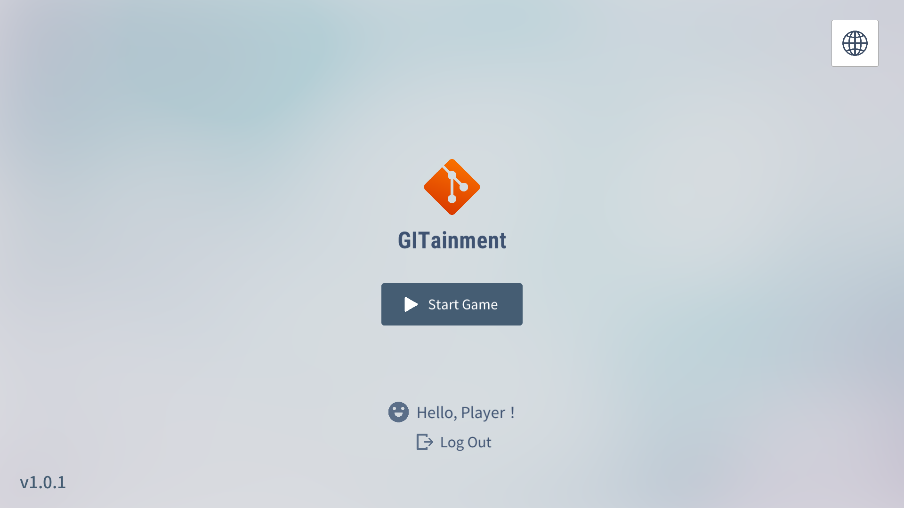
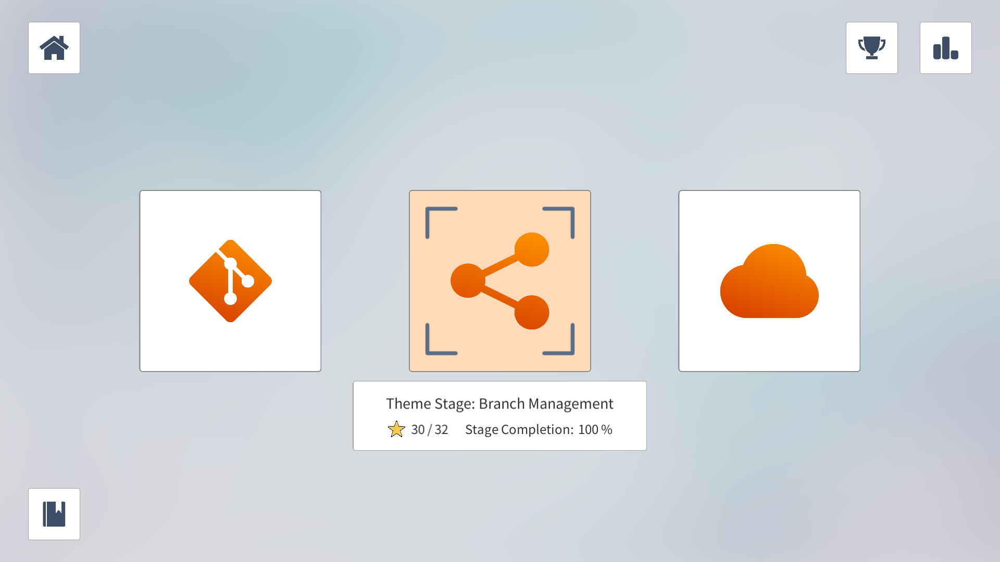
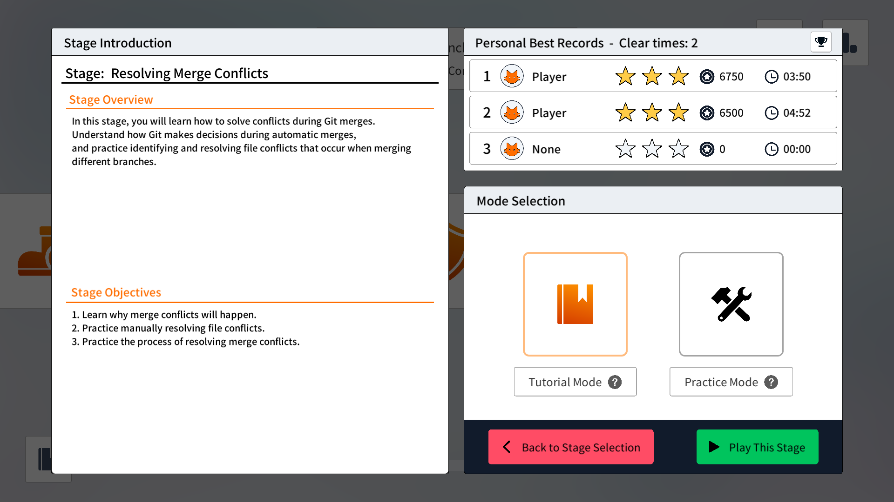
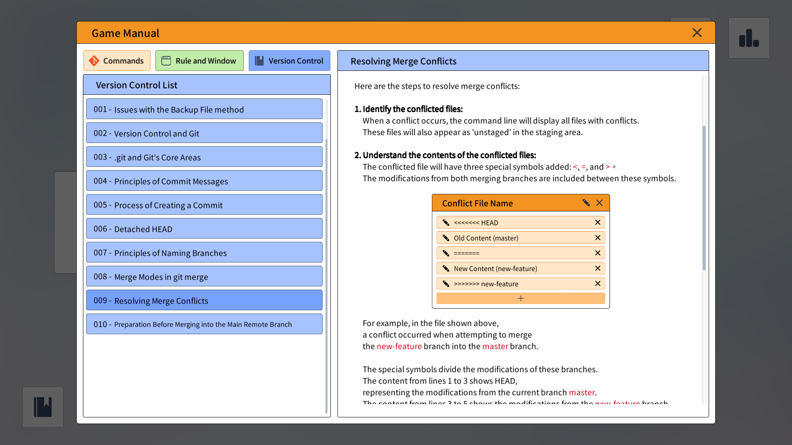
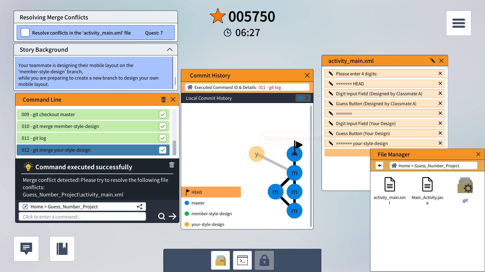
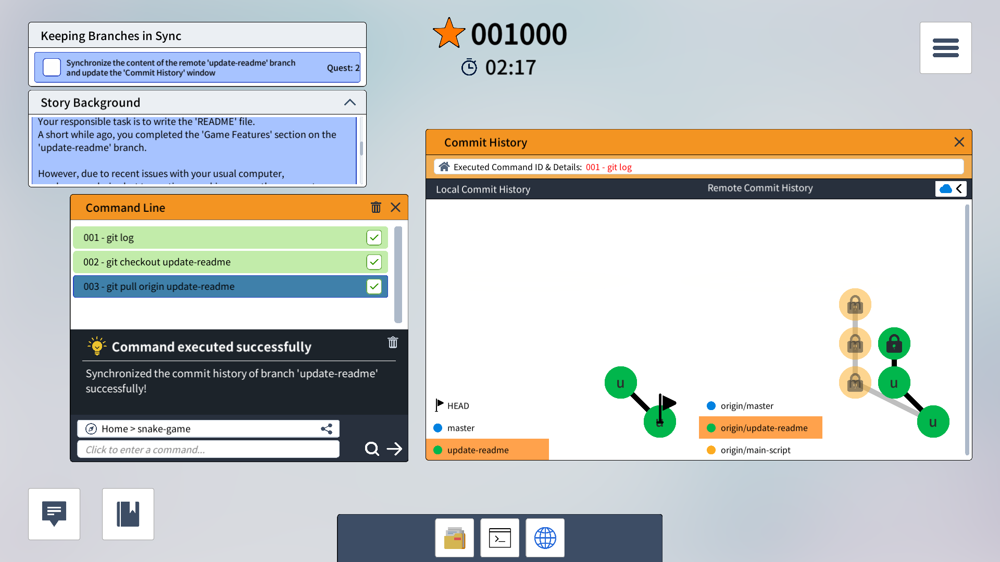
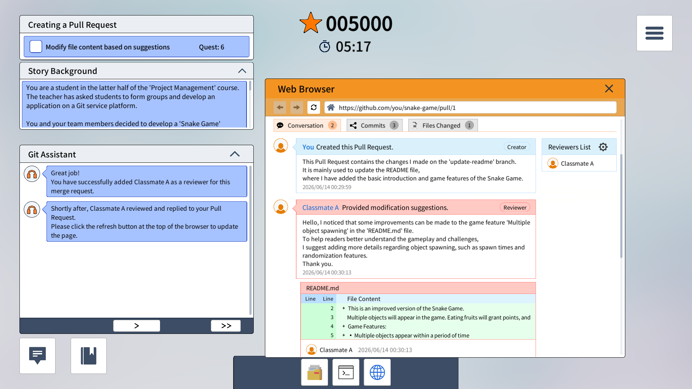
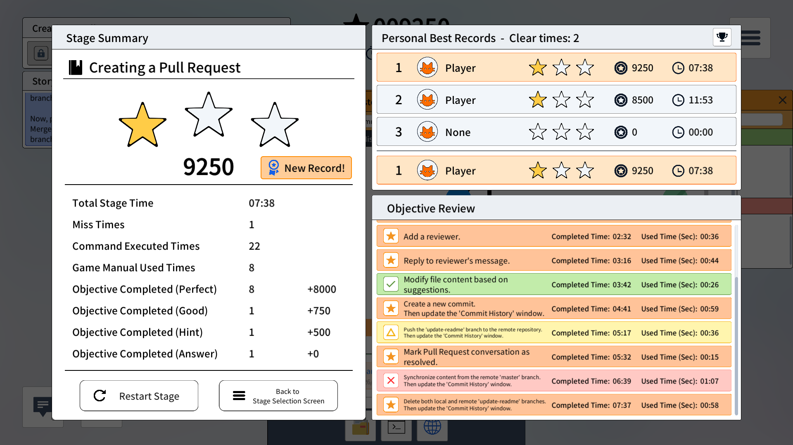

# 🎮 Gitainment - Git Interactive Tutorial Game

  🌐 <b>Language Select / 語言切換</b>
   
  <!-- 在 docs 資料夾內，所以用 ../ 跳回根目錄 -->
  ⭐️ <b>English</b> ⭐️
   
  <a href="./docs/zh/README.md">繁體中文</a>

Gitainment is a Git tutorial game specifically designed for programming beginners and students. This project utilizes Unity Engine to develop the frontend game visuals, combined with a Node.js backend and a MongoDB database, to materialize abstract Git commands and version control concepts. The system also features a dynamic event tracking feature to assist teachers in analyzing students' learning processes and bottlenecks.

---

## 🎯 System Objectives

Traditional Git teaching heavily relies on the Command Line Interface (CLI), which presents a higher entry barrier and lacks intuitive feedback for beginners.
Gitainment aims to:

- **Enhance Learning Motivation**: Transform tedious command operations into game levels.
- **Improve Learning Efficiency**: Allow students to intuitively understand concepts like `commit` and `merge` through localized graphics (such as the growth of the branch tree).
- **Address Classroom Deficiencies**: Resolve the pain points in school curricula, such as the lack of real-time feedback and the inability to make low-cost repeated attempts.

---

## ✨ Core Game Features & Benefits

- **Intrinsic Motivation Enhancement**: Based on gamification learning theory, learning objectives are transformed into "in-game mission challenges" to increase the willingness for self-directed learning.
- **Low Cost of Failure**: Provides a safe simulated environment, encouraging students to make repeated attempts when "screwing up the repository," thereby overcoming the fear of Git Merge Conflicts.
- **Immersive Experience**: Utilizes the competitive and challenging nature of the game within limited instructional time to achieve Deep Learning effects.
- **Empowering Teachers**: The backend automatically collects behavioral data, allowing teachers to see at a glance which Git commands represent common blind spots for the entire class.

---

## 🕹️ Gamification Mechanisms

To motivate students for continuous engagement, the game incorporates the following mechanisms:

- **🏆 Real-time Leaderboard**: Displays completion times and star counts for the entire class or specific levels, stimulating healthy competition.
- **⚡ Visualized Command Feedback**: When a command is entered, the in-game character performs a corresponding action, and the version control tree dynamically updates in real-time.

---

## 📸 Screenshots

---

## 🛠️ Installation & Setup

If you want to co-develop this project or conduct testing in a local environment, we have prepared a comprehensive step-by-step tutorial. This includes frontend configuration for Unity, backend installation for Node.js, and a connection guide for the MongoDB database.

For detailed steps, please click the link below to refer to the guide:

🚀 **[🎮 GITainment Project Introduction & Deployment Guide](./docs/en/tutorial.md)**

---
